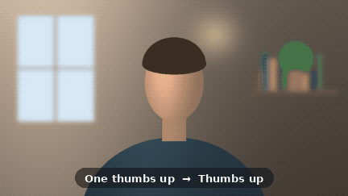
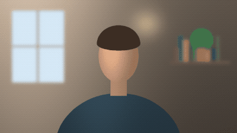
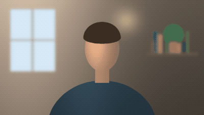
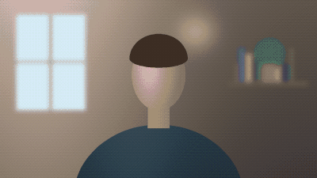
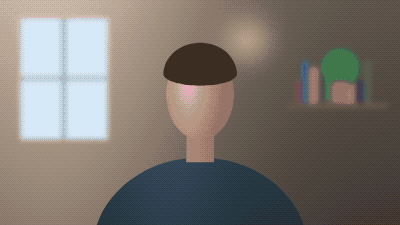
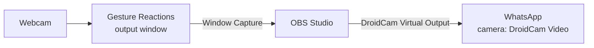
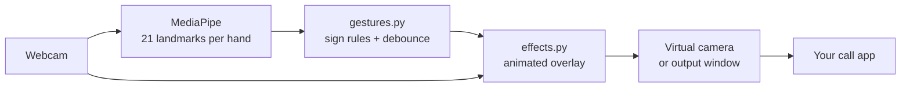

<p align="center">
  
</p>

<p align="center">
  <a href="https://github.com/saihardhikreddy/gesture-reactions/actions/workflows/ci.yml"></a>
  
  
  
  
  <a href="LICENSE"></a>
</p>

<p align="center">
  <b>Throw up a 👍 on a call and your video explodes with fireworks.</b><br>
  The hand-sign reactions from macOS Sonoma, rebuilt for Windows, working in<br>
  WhatsApp, Zoom, Google Meet, Microsoft Teams, Discord and anything else with a camera picker.
</p>

<p align="center">
  
</p>

---

## ✨ Reactions

Hold a sign up to your webcam for about half a second, with your whole hand in frame. After a reaction there's a 3 second pause before the next one. You can also fire each one with its key.

| Hand sign | | Reaction | Key |
|:--|:-:|:--|:-:|
| 👍 One thumbs up | → | **Thumbs up** | `1` |
| 👎 One thumbs down | → | **Thumbs down** | `2` |
| 👍👍 Two thumbs up | → | **Fireworks** 🎆 | `3` |
| 👎👎 Two thumbs down | → | **Rain** 🌧️ | `4` |
| ✌️ One peace sign | → | **Balloons** 🎈 | `5` |
| ✌️✌️ Two peace signs | → | **Confetti** 🎉 | `6` |
| 🤘🤘 Two rock-on hands | → | **Lasers** 🔦 | `7` |
| 🫶 Heart hands (index fingertips touch at the top, thumb tips at the bottom) | → | **Hearts** 💖 | `8` |

The effects are made to feel like Apple's: glossy 3D hearts, balloons and thumbs that spring in with a little overshoot, confetti that flips as it falls, glowing fireworks and lasers over a dimmed room, and a rain cloud that turns everything grey-blue.

<table>
  <tr>
    <td align="center"><br><b>Thumbs up</b></td>
    <td align="center"><br><b>Thumbs down</b></td>
    <td align="center"><br><b>Fireworks</b></td>
    <td align="center"><br><b>Rain</b></td>
  </tr>
  <tr>
    <td align="center"><br><b>Balloons</b></td>
    <td align="center"><br><b>Confetti</b></td>
    <td align="center"><br><b>Lasers</b></td>
    <td align="center"><br><b>Hearts</b></td>
  </tr>
</table>

## 🚀 Setup (once)

You need Windows 10 or 11 and a webcam.

1. **Install Python 3.12** from [python.org](https://www.python.org/downloads/). On the first installer screen, tick **Add python.exe to PATH**, then click *Install Now*.
2. **Install [OBS Studio](https://obsproject.com/).** It provides the **OBS Virtual Camera** that call apps pick up. Open it once and accept the defaults.
3. **Download this app:** on this GitHub page click **Code → Download ZIP**, then right-click the ZIP → **Extract All…** (for example to your Desktop).
4. **Open the extracted `gesture-reactions` folder and double-click `setup.bat`.** It creates a private Python environment and installs everything. Wait for *Setup done*, then press any key.

The first run downloads the 8 MB hand-tracking model, so it takes a little longer.

> [!TIP]
> For WhatsApp you also need DroidCam; see [WhatsApp Desktop](#-whatsapp-desktop).

## 🔄 Updating

Double-click **`update.bat`**. If you cloned with git it pulls the latest version; if you used the ZIP it tells you to download the new ZIP and extract it over the folder. Either way it then refreshes the Python packages.

## 📷 Pick your camera (once, and again if the window is black)

Phone-link cameras and **OBS Virtual Camera** also show up as camera numbers, so number `0` is not always your webcam.

1. Open the `gesture-reactions` folder in File Explorer, click the address bar, type `cmd` and press **Enter**. A command window opens in that folder.
2. Run:

   ```bat
   run-whatsapp.bat --list-cameras
   ```

   It prints each camera number with `picture OK` or `BLACK frames`, for example:

   ```text
   index  backend  result
       0  msmf     1280x720, picture OK
       1  msmf     1280x720, picture OK
   ```

   Your webcam is the one that says `picture OK` and turns its light on while it's tested. If you're not sure, try each number in the next step.
3. Start the app with that number, for example `run-whatsapp.bat --camera 0` (or `run.bat --camera 0`). The .bat files pass any options through, so use the same `--camera N` every time.

## 💬 WhatsApp Desktop

WhatsApp's in-call camera menu only lists **Media Foundation** cameras. **OBS Virtual Camera** isn't one, so even when it appears under *Settings → Video & voice*, it's missing from the call itself (on a typical Windows 11 laptop the call only offers *Integrated Camera* and a *Phone Link* camera) and calls quietly fall back to your real webcam. **DroidCam Video** is a Media Foundation camera that WhatsApp does list, so the video goes through OBS and DroidCam:



Set it up once and follow the same order on every call: see **[DroidCam Client and OBS setup](#-droidcam-client-and-obs-setup)** below.

Never pick your real webcam in WhatsApp: the app is already using it.

> [!NOTE]
> This works for WhatsApp on a PC. It can't add effects to calls made from the WhatsApp phone app.

## 🔌 DroidCam Client and OBS setup

Only needed for WhatsApp. DroidCam is normally a "phone as webcam" app, but here it's only used for its **DroidCam Video** webcam device, which OBS feeds through the DroidCam plugin. **No phone is needed.**

### One-time setup

1. **Install the DroidCam Client for Windows** from [dev47apps.com](https://www.dev47apps.com/) (the Windows client, not the phone app). It installs the **DroidCam Video** webcam device. You don't need to open it or connect a phone.
2. **Install the DroidCam OBS plugin:** download the Windows installer from [droidcam-obs-plugin releases](https://github.com/dev47apps/droidcam-obs-plugin/releases) and run it. In OBS 32 or newer, check that **Tools → Plugin Manager** shows **DroidCam** ticked.
3. **Restart the PC**, so Windows and WhatsApp pick up the new camera.
4. **Open OBS → Settings → Video** and set **Base (Canvas) Resolution** and **Output (Scaled) Resolution** to **1280x720** and **Common FPS Values** to **30**. Click **OK**.
5. **Run `run-whatsapp.bat`** and wait until your face shows in the **Gesture Reactions Output** window.
6. **In OBS, under Sources, click + → Window Capture → OK.** Set *Window* to **`[python.exe]: Gesture Reactions Output`** and *Capture Method* to **Windows 10 (1903 and up)**, then click **OK**.
7. **Click the new source and press Ctrl+F** (Fit to screen) so it fills the picture. OBS remembers this scene.
8. **Remove or hide any *Video Capture Device* source** that uses your real webcam (click the eye icon, or select it and press Delete). It would steal the webcam from the app.

### Every call (order matters)

1. **Quit WhatsApp fully:** right-click its tray icon (bottom-right, near the clock) → **Quit**. Closing the window isn't enough; WhatsApp only reads the camera list when it starts.
2. **Double-click `run-whatsapp.bat`** (or `run-whatsapp.bat --camera N`) and wait for your face in the **Gesture Reactions Output** window. Keep it open and not minimised; behind other windows is fine.
3. **Open OBS** and check its preview shows you. Turn on **Tools → DroidCam Virtual Output** (it gets a tick). **Don't** click *Start Virtual Camera*. Keep OBS open for the whole call.
4. **Open WhatsApp and start the call.** Click the small arrow next to the camera button and choose **DroidCam Video**. Also set **Settings → Video & voice → Camera** to **DroidCam Video** so the next call starts with it.
5. Press `1` in the Output window: the other person should see a thumbs-up. Then use your hands.

If the call shows a green picture or DroidCam Video isn't listed, see *Troubleshooting* below.

## 🎥 Zoom · Google Meet · Microsoft Teams · Discord

1. Double-click **`run.bat`** (or run `run.bat --camera N` from the command window). A mirrored preview window opens.
2. In the call app's video settings, pick **OBS Virtual Camera**. You don't need to open OBS for these apps.

Keep the app running for the whole call.

## 🧠 How it works



- **Tracking:** Google's MediaPipe Hand Landmarker finds up to two hands per frame and returns 21 points for each.
- **Recognition:** `gestures.py` turns those points into signs using distances measured relative to hand size, so it works close to or far from the camera, with either hand.
- **Debounce:** a sign has to be held steadily (75% of frames over 0.45 s) before it fires, then there's a 3 s cooldown, so waving your hands around doesn't set off a show.
- **Effects:** `effects.py` draws everything with OpenCV and NumPy. Hearts, balloons, the thumbs and the rain cloud are shaded as 3D shapes once at startup and cached, so each frame only blends small images, adds glow at low resolution and applies a quick colour grade. That keeps every effect at a few milliseconds per 720p frame.
- **Output:** frames go to OBS Virtual Camera through [pyvirtualcam](https://github.com/letmaik/pyvirtualcam), or to an output window for WhatsApp.

Everything runs locally. No video leaves your PC except through your call app.

## ⚙️ Options

```text
python gesture_reactions.py [options]

  --camera 1        another webcam (or a video file, for testing)
  --width 1280 --height 720 --fps 30
  --hold 0.45       seconds a sign must be held
  --cooldown 3.0    seconds between reactions
  --backend auto    camera API: auto (Media Foundation, then DirectShow), msmf or dshow
  --list-cameras    show which camera numbers work and which give a black picture
  --whatsapp        output window for OBS + DroidCam instead of the virtual camera
  --no-virtual-cam  preview only
  --no-preview      no preview window
```

The .bat files pass options through, for example `run.bat --camera 1`.

**Keys** (click the preview window first): `1`–`8` fire a reaction by hand · `g` pause detection · `l` show the hand skeleton · `q` / `Esc` quit.

## 🛠️ Troubleshooting

<details>
<summary><b><code>VIDEOIO(DSHOW): raised unknown C++ exception</code> then "Could not open camera"</b></summary>

You're running an old version that only tried DirectShow. Run **`update.bat`**, then start the app again. The current version tries Media Foundation first and prints lines like `Camera 0: using msmf backend.`
</details>

<details>
<summary><b>"Could not open camera"</b></summary>

Close other apps using the webcam (including the call app's preview), then run `run-whatsapp.bat --list-cameras` and use a number that says `picture OK`, for example `run.bat --camera 1`.
</details>

<details>
<summary><b>Black window and the webcam light stays off</b></summary>

Another app (often OBS with a webcam source, Teams or the Camera app) may be holding the webcam, or the camera number now points at a different device. In a command window in this folder (type `cmd` in Explorer's address bar), run:

```bat
run-whatsapp.bat --list-cameras
```

Then start with a number that says `picture OK`, for example `run-whatsapp.bat --camera 1`. Add `--backend dshow` or `--backend msmf` if only one of them works. If every camera is black, close OBS and other camera apps, check *Settings → Privacy & security → Camera* (allow desktop apps), and restart the PC.
</details>

<details>
<summary><b>Reactions show in OBS but not in WhatsApp</b></summary>

WhatsApp is still using another camera. In OBS check that *Tools → DroidCam Virtual Output* is on. Then quit WhatsApp from the tray, reopen it, and pick **DroidCam Video** both in *Settings → Video & voice* **and** with the arrow next to the camera button inside the call.
</details>

<details>
<summary><b>WhatsApp settings list OBS Virtual Camera, but the call doesn't</b></summary>

That's expected. WhatsApp calls only offer Media Foundation cameras (your webcam, DroidCam Video, a Phone Link phone camera), and OBS Virtual Camera is an older DirectShow camera. Use the DroidCam route in [WhatsApp Desktop](#-whatsapp-desktop).
</details>

<details>
<summary><b>My video only fills a corner of the OBS picture</b></summary>

In OBS click the Window Capture source and press **Ctrl+F** (right-click → *Transform → Fit to screen*).
</details>

<details>
<summary><b>Lots of log lines like <code>W0000</code> or TensorFlow Lite messages</b></summary>

Those come from MediaPipe when it starts and are harmless. Ignore them.
</details>

<details>
<summary><b>"Virtual camera unavailable"</b></summary>

This message comes from `run.bat`. Install OBS Studio, and if OBS's own *Start Virtual Camera* is on, stop it: only one program can feed the virtual camera at a time. (`run-whatsapp.bat` doesn't use it directly; there OBS starts the virtual camera itself.)
</details>

<details>
<summary><b>My signs aren't detected</b></summary>

Face a light, keep your whole hand in frame about an arm's length from the camera, and hold still for half a second. Press `l` to see the skeleton the tracker sees.
</details>

<details>
<summary><b>DroidCam Video doesn't show up in WhatsApp</b></summary>

Make sure *Tools → DroidCam Virtual Output* is on in OBS, then fully quit and reopen WhatsApp. If it still isn't listed, reinstall the DroidCam plugin and restart. As a last resort, share the Gesture Reactions Output window with WhatsApp's screen-share button.
</details>

<details>
<summary><b>Choppy video</b></summary>

Use `run.bat --width 960 --height 540`.
</details>

## 🧪 Development

```powershell
pip install -r requirements-dev.txt
pytest                           # gesture rules on synthetic hands, every effect on blank frames
python scripts/render_demo.py    # regenerate docs/demo.gif and docs/reactions/*.gif
python scripts/bench_effects.py  # milliseconds per frame for each effect
```

| File | What it does |
|:--|:--|
| `gesture_reactions.py` | webcam, hand tracking, virtual camera, windows, keys |
| `gestures.py` | landmarks → signs → reactions, plus the hold/cooldown trigger |
| `effects.py` | the eight animated effects, their 3D sprites, easing and glow |
| `tests/` | gesture-rule, effect and camera-fallback tests that run without a webcam |
| `scripts/` | demo GIF renderer and effect benchmark |
| `setup.bat` · `update.bat` | create the Python environment · pull the latest version |
| `run.bat` · `run-whatsapp.bat` | start for Zoom/Meet/Teams · start for WhatsApp |

## 🗺️ Ideas

- [ ] System tray app with an on/off toggle
- [ ] Custom gesture → effect mapping in a config file
- [ ] Native Windows 11 (Media Foundation) virtual camera, so WhatsApp works without OBS and DroidCam
- [ ] Packaged `.exe` release

## 🙏 Credits

Inspired by Apple's Reactions in macOS Sonoma. Built on [MediaPipe](https://ai.google.dev/edge/mediapipe), [OpenCV](https://opencv.org/), [pyvirtualcam](https://github.com/letmaik/pyvirtualcam), [OBS Studio](https://obsproject.com/) and [DroidCam](https://github.com/dev47apps/droidcam-obs-plugin). Not affiliated with Apple, Meta or WhatsApp.

The thumbs-up and thumbs-down are drawn from [Twemoji](https://github.com/jdecked/twemoji) artwork, © Twitter, Inc and other contributors, licensed [CC-BY 4.0](https://creativecommons.org/licenses/by/4.0/) (given 3D shading here). Everything else is drawn in code.

## 📄 License

[MIT](LICENSE) © Hardhik
