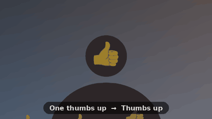
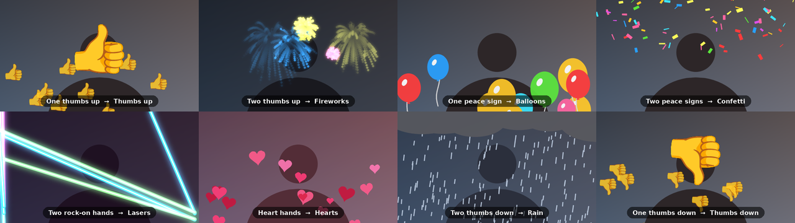
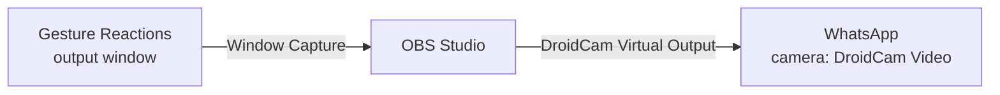
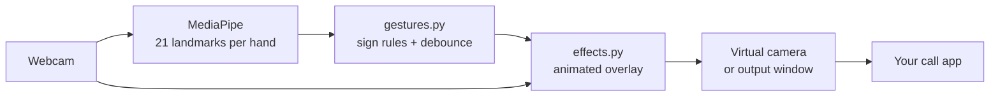

<p align="center">
  
</p>

<p align="center">
  <a href="https://github.com/saihardhikreddy/gesture-reactions/actions/workflows/ci.yml"></a>
  
  
  
  
  <a href="LICENSE"></a>
</p>

<p align="center">
  <b>Throw up a 👍 on a call and your video explodes with fireworks.</b><br>
  The hand-sign reactions from macOS Sonoma, rebuilt for Windows, working in<br>
  WhatsApp, Zoom, Google Meet, Microsoft Teams, Discord and anything else with a camera picker.
</p>

<p align="center">
  
</p>

---

## ✨ Reactions

Hold a sign up to your webcam for about half a second.

| Hand sign | | Reaction |
|:--|:-:|:--|
| 👍 One thumbs up | → | **Thumbs up** |
| 👎 One thumbs down | → | **Thumbs down** |
| 👍👍 Two thumbs up | → | **Fireworks** 🎆 |
| 👎👎 Two thumbs down | → | **Rain** 🌧️ |
| ✌️ One peace sign | → | **Balloons** 🎈 |
| ✌️✌️ Two peace signs | → | **Confetti** 🎉 |
| 🤘🤘 Two rock-on hands | → | **Lasers** 🔦 |
| 🫶 Heart hands | → | **Hearts** 💖 |

<p align="center"></p>

## 🚀 Quick start

**You need:** Windows 10 or 11, a webcam, [Python 3.12+](https://www.python.org/downloads/) (tick *Add python.exe to PATH*) and [OBS Studio](https://obsproject.com/) (it supplies the virtual camera driver).

```powershell
git clone https://github.com/saihardhikreddy/gesture-reactions.git
cd gesture-reactions
setup.bat
```

No git? Click **Code → Download ZIP**, unzip it and double-click `setup.bat`.

Then pick your app:

| Calling on | Run | Choose this camera in the app |
|:--|:--|:--|
| Zoom · Meet · Teams · Discord · Skype | `run.bat` | **OBS Virtual Camera** |
| WhatsApp Desktop | `run-whatsapp.bat` | **DroidCam Video** (see below) |

The first run downloads the 8 MB hand-tracking model. Keep the app running for the whole call.

## 💬 WhatsApp Desktop

WhatsApp Desktop doesn't list OBS Virtual Camera, so the video takes a short detour through OBS and the free DroidCam virtual camera, which WhatsApp accepts.



**Once:** install the DroidCam OBS plugin from the [releases page](https://github.com/dev47apps/droidcam-obs-plugin/releases), restart your PC, and in OBS set *Settings → Video* to 1280×720 at 30 FPS.

**Every call:**

1. Double-click `run-whatsapp.bat`. A window called **Gesture Reactions Output** opens; leave it un-minimised (behind other windows is fine).
2. In OBS add **+ → Window Capture → `[python.exe]: Gesture Reactions Output`** (capture method *Windows 10 (1903 and up)*), then right-click it → *Transform → Fit to screen*. OBS remembers this, so it's a one-time step too.
3. In OBS turn on **Tools → DroidCam Virtual Output**.
4. In WhatsApp pick **DroidCam Video** under *Settings → Video & voice*.

> [!NOTE]
> This works for WhatsApp on a PC. It can't add effects to calls made from the WhatsApp phone app.

## 🧠 How it works



- **Tracking:** Google's MediaPipe Hand Landmarker finds up to two hands per frame and returns 21 points for each.
- **Recognition:** `gestures.py` turns those points into signs using distances measured relative to hand size, so it works close to or far from the camera, with either hand.
- **Debounce:** a sign has to be held steadily (75% of frames over 0.45 s) before it fires, then there's a 3 s cooldown, so waving your hands around doesn't set off a show.
- **Effects:** `effects.py` draws everything with OpenCV and NumPy, with the real Windows emoji font (Segoe UI Emoji) for the thumbs.
- **Output:** frames go to OBS Virtual Camera through [pyvirtualcam](https://github.com/letmaik/pyvirtualcam), or to an output window for WhatsApp.

Everything runs locally. No video leaves your PC except through your call app.

## ⚙️ Options

```text
python gesture_reactions.py [options]

  --camera 1        another webcam (or a video file, for testing)
  --width 1280 --height 720 --fps 30
  --hold 0.45       seconds a sign must be held
  --cooldown 3.0    seconds between reactions
  --backend auto    camera API: auto (Media Foundation, then DirectShow), msmf or dshow
  --list-cameras    show which camera numbers work and which give a black picture
  --whatsapp        output window for OBS + DroidCam instead of the virtual camera
  --no-virtual-cam  preview only
  --no-preview      no preview window
```

The .bat files pass options through, for example `run.bat --camera 1`.

**Keys** (click the preview window first): `1`–`8` fire a reaction by hand · `g` pause detection · `l` show the hand skeleton · `q` / `Esc` quit.

## 🛠️ Troubleshooting

<details>
<summary><b>"Could not open camera"</b></summary>

Close other apps using the webcam (including the call app's preview), or try `run.bat --camera 1`.
</details>

<details>
<summary><b>Black window and the webcam light stays off</b></summary>

Another app (often OBS with a webcam source) may be holding the camera, or a camera number now points at a different device. From a PowerShell window in this folder, run:

```powershell
.\run-whatsapp.bat --list-cameras
```

It prints each camera number with `picture OK` or `BLACK frames`. Then start with a number that says `picture OK`, for example `.\run-whatsapp.bat --camera 1` (add `--backend dshow` or `--backend msmf` if only one of them works). If every camera is black, close OBS and other camera apps, check *Settings → Privacy & security → Camera*, and restart the PC.
</details>

<details>
<summary><b>"Virtual camera unavailable"</b></summary>

Install OBS Studio. If OBS's own *Start Virtual Camera* is on, stop it: only one program can feed the virtual camera at a time.
</details>

<details>
<summary><b>My signs aren't detected</b></summary>

Face a light, keep your whole hand in frame about an arm's length from the camera, and hold still for half a second. Press `l` to see the skeleton the tracker sees.
</details>

<details>
<summary><b>DroidCam Video doesn't show up in WhatsApp</b></summary>

Make sure *Tools → DroidCam Virtual Output* is on in OBS, then fully quit and reopen WhatsApp. If it still isn't listed, reinstall the DroidCam plugin and restart. As a last resort, share the Gesture Reactions Output window with WhatsApp's screen-share button.
</details>

<details>
<summary><b>Choppy video</b></summary>

Use `run.bat --width 960 --height 540`.
</details>

## 🧪 Development

```powershell
pip install -r requirements-dev.txt
pytest                         # gesture rules, tested on synthetic hands
python scripts/make_demo.py    # regenerate assets/demo.gif and effects.png
```

| File | What it does |
|:--|:--|
| `gesture_reactions.py` | webcam, hand tracking, virtual camera, windows, keys |
| `gestures.py` | landmarks → signs → reactions, plus the hold/cooldown trigger |
| `effects.py` | the eight animated effects |
| `tests/` | gesture-rule and camera-fallback tests that run without a webcam |

## 🗺️ Ideas

- [ ] System tray app with an on/off toggle
- [ ] Custom gesture → effect mapping in a config file
- [ ] Native Windows 11 virtual camera, so WhatsApp works without OBS
- [ ] Packaged `.exe` release

## 🙏 Credits

Inspired by Apple's Reactions in macOS Sonoma. Built on [MediaPipe](https://ai.google.dev/edge/mediapipe), [OpenCV](https://opencv.org/), [pyvirtualcam](https://github.com/letmaik/pyvirtualcam), [OBS Studio](https://obsproject.com/) and [DroidCam](https://github.com/dev47apps/droidcam-obs-plugin). Not affiliated with Apple, Meta or WhatsApp.

## 📄 License

[MIT](LICENSE) © Hardhik
